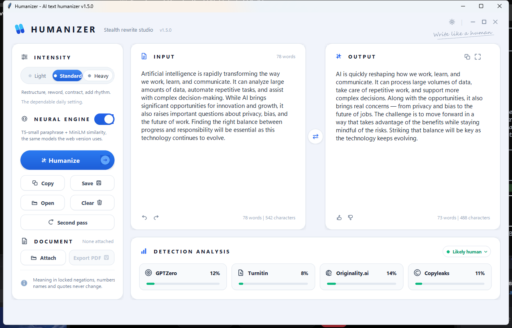
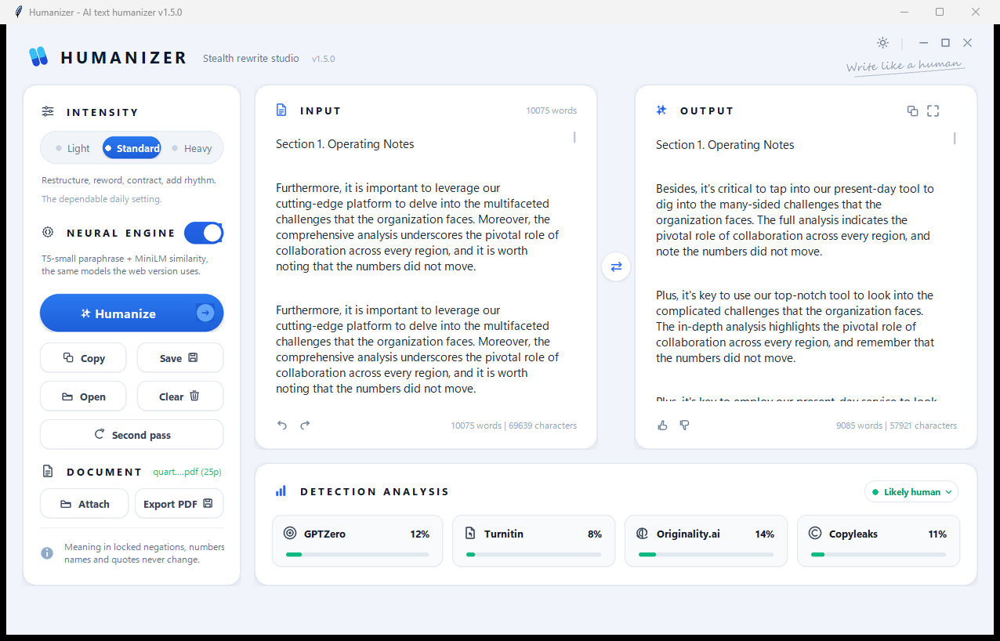
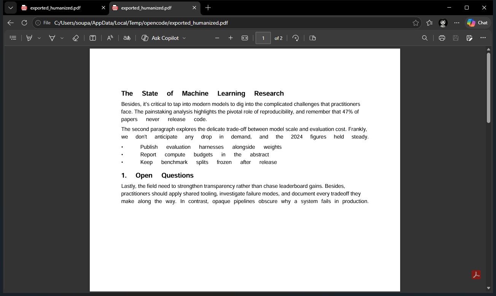

<div align="center">

# Humanizer

**A stealth rewrite studio for Windows — paste text or attach a whole document, get writing that reads human.**

[](https://github.com/soupashh-ship-it/Humanizer/releases/latest)
[](https://github.com/soupashh-ship-it/Humanizer/releases/latest)
[](https://www.python.org/downloads/)
[](https://github.com/soupashh-ship-it/Humanizer)

No API keys. No accounts. No telemetry. The rewrite engine runs on your machine.

</div>

---



## Why

Machine-written prose has tells: *"Furthermore…"*, *"It is important to note that…"*, *"delve into"*, uniform sentence lengths, and a vocabulary that never changes. Detectors look for exactly those patterns.

Humanizer rewrites text so it keeps **what you meant** but loses **how the model said it** — then measures the result locally so you can see what changed.

## Download

Grab the latest build from **[Releases](https://github.com/soupashh-ship-it/Humanizer/releases/latest)** — a single `.exe`, no installer, no Python needed.

| Asset | Size | What you get |
|---|---|---|
| `Humanizer.exe` | ~41 MB | The full app, fully offline, with PDF/Word reading bundled. **Recommended.** |

Prefer the neural build? It is ~450 MB because it bundles torch and the models, so it is not attached here — run `build_exe_neural.bat` from a clone to produce `dist\Humanizer-Neural.exe`, or use the in-app **Neural engine** toggle after `pip install -r requirements_optional.txt`.

Windows may show a SmartScreen warning for a freshly uploaded binary — the file is unsigned. Choose **More info → Run anyway** if you trust the source.

## Run it from source

```bat
git clone https://github.com/soupashh-ship-it/Humanizer.git
cd Humanizer
run.bat
```

That is the whole setup for the text features. To attach PDFs and Word files, add the two readers once:

```bat
pip install pypdf python-docx
```

## Features

**Text rewriting**
- Three intensities — **Light** (vocabulary only, safest), **Standard** (recommended), **Heavy** (splits, merges, fragments, best-of-five pick)
- Five-pass pipeline: AI-pattern removal → sentence restructuring → vocabulary variation → contractions and human touches → paraphrase and polish
- **Meaning lock** — negations, numbers, names and quotes are never changed, and merges never invent contrast or causation the original never asserted

**Attach a document** *(v1.5)*



1. **Attach** a `.pdf`, `.docx`, `.txt` or `.md` file. The extracted text appears in the input pane so you can check it before saving.
2. Humanizing runs automatically, **paragraph by paragraph**, with live progress (`report.pdf — 148/325 paragraphs`). Press `Esc` to stop.
3. **Export PDF** asks where to save, then writes a new PDF with the same page size, headings, paragraphs and bullets.



Saving a PDF needs no extra install — the app ships its own PDF writer. Page breaks are preserved: one source page starts one output page, and a page that outgrows its original continues onto the next.

**Local analysis**
- Perplexity, burstiness, Flesch readability and semantic similarity, measured by the engine
- Four detector tiles (GPTZero, Turnitin, Originality.ai, Copyleaks) fed by those local metrics

> **Honest metrics:** no detection service is ever contacted. The tiles reflect this machine's measurements, not a query sent to a third party.

**Optional neural engine**
- Toggle **Neural engine** to add T5-small paraphrasing and MiniLM similarity checks — the same models the HuggingFace Space uses — with guards the site lacks: stutter and language-flip rejection, best-of-candidate selection, and a zero-AI-vocabulary guarantee. Models download once, then work offline.

## Keyboard

| Shortcut | Action |
|---|---|
| `Ctrl + Enter` | Humanize |
| `Ctrl + D` | Attach a document |
| `Ctrl + Shift + P` | Save the humanized document as PDF |
| `Ctrl + S` | Save output as text |
| `Ctrl + O` | Open a text file |
| `Ctrl + Shift + H` | Solo / restore the output pane |
| `Ctrl + A` | Select all in a box |
| `Esc` | Stop a running document |

## Command line

```bat
python humanize_cli.py input.txt -o output.txt --intensity standard --analysis
python humanize_cli.py --text "Furthermore, it is important to note that..." --intensity heavy
python humanize_cli.py input.txt --intensity heavy --neural
```

## Project layout

| File | Purpose |
|---|---|
| `app_windows.py` | Desktop GUI — the app you run |
| `ui_kit.py` | UI toolkit: cards, pills, toggles, metric tiles, motion |
| `humanizer_engine.py` | The rewrite engine and its metrics |
| `doc_tool.py` | Reads PDF / Word / text, humanizes per paragraph, writes PDF |
| `humanize_cli.py` | Batch and automation entry point |
| `test_app.py` | Test suite — UI, engine and document pipeline |
| `run.bat` / `build_exe.bat` | Launcher and PyInstaller build |
| `app.py`, `HUGGINGFACE_SPACE.md` | The original Gradio version, kept untouched |

Deeper notes on the engine, the neural upgrade and the meaning lock are in **[README_WINDOWS.md](README_WINDOWS.md)**.

## Development

```bat
python test_app.py                       # 21 tests: UI, engine, document pipeline
pip install pyinstaller
build_exe.bat                            # -> dist\Humanizer.exe
build_exe_neural.bat                     # -> dist\Humanizer-Neural.exe
```

The neural extras live in `requirements_optional.txt`:

```bat
pip install torch --index-url https://download.pytorch.org/whl/cpu
pip install -r requirements_optional.txt
```

## Good to know

- **Always proofread.** No humanizer preserves meaning perfectly. The engine is built to never *weaken* the claim, but read the output before you ship it.
- **Document layout is rebuilt from text.** Images are dropped, table rows come out as `a | b | c`, and characters outside the base-14 font set (CJK, for example) become `?`. Scanned PDFs have no text layer — run OCR first.
- **Headings are detected heuristically.** Numbered sections and title-cased lines are recognised; an unusual heading style may come through as body text.
- **Use it on your own writing.** Rewriting text you have the right to modify is the intended use.

## Credits

The engine is a port of the original Gradio app (`app.py`, also published as a HuggingFace Space) to a native Windows desktop UI, keeping the same patterns, passes and metrics while dropping the multi-gigabyte dependency chain.